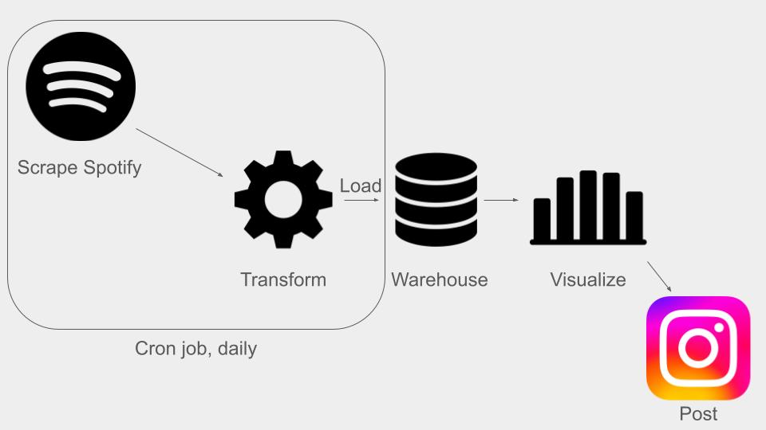

## Description
[Rapmetrics](https://www.instagram.com/rapmetrics/) is an Instagram account that visualizes rap data. This repo contains the code on how the data is obtained and stored.




## Installation

Clone the repository:
```bash
git clone https://github.com/anthonydangg/rapmetrics
cd rapmetrics
```

Create a virtual environment (optional):
```bash
python3 -m venv .venv
source .venv/bin/activate  # On Windows, use .venv\Scripts\activate
```

Install dependencies:
```bash
pip install -r requirements.txt
```

## Environment Variables

This project requires some environment variables for API keys and database connections. 

Create a `.env` file in the monthly_listeners_scraper directory after filling out `template.env`:
   ```bash
   cp template.env src/monthy_listeners_scraper/.env
